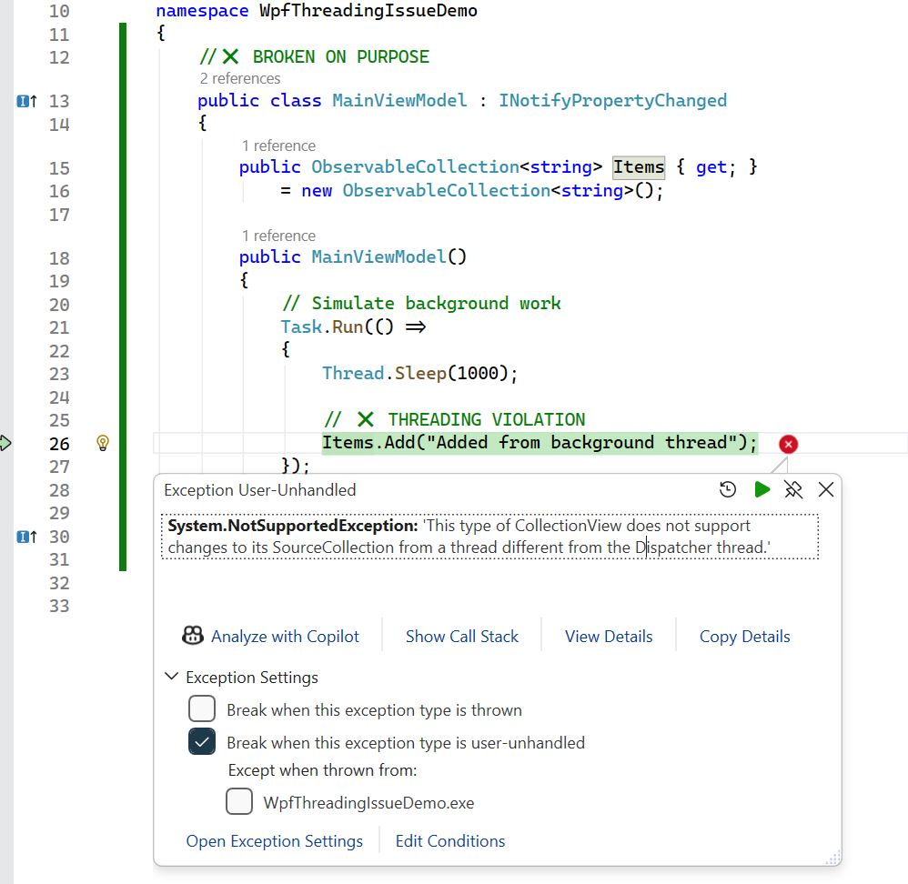

# WPF Threading Violation with Data Binding  
**.NET Framework 4.7.2**

## Overview

WPF uses a **single-threaded UI model**.  
All UI elements and objects involved in UI data binding must be accessed **only from the UI (Dispatcher) thread**.

A very common violation occurs when a **background thread updates a bound `ObservableCollection`** or raises
change notifications that WPF then tries to process on the UI thread.

This document demonstrates a **real, minimal example** of such a violation, explains why it happens, and shows
the correct fix.

---

## The Rule You Must Not Break

> **Background threads may do work, but all bound UI updates must happen on the Dispatcher (UI) thread.**

This includes:
- `ObservableCollection<T>` modifications
- `INotifyPropertyChanged` notifications
- Any interaction with UI-bound objects

---

## Broken Example (Threading Violation)

### Scenario

- A `ListBox` is bound to an `ObservableCollection<string>`
- A background task adds an item to the collection
- WPF crashes at runtime

---

## MainWindow.xaml

```xml
<Window x:Class="ThreadingViolationDemo.MainWindow"
        xmlns="http://schemas.microsoft.com/winfx/2006/xaml/presentation"
        xmlns:x="http://schemas.microsoft.com/winfx/2006/xaml"
        Title="Threading Violation Demo"
        Height="200"
        Width="300">

    <Grid Margin="10">
        <ListBox ItemsSource="{Binding Items}" />
    </Grid>
</Window>
```



